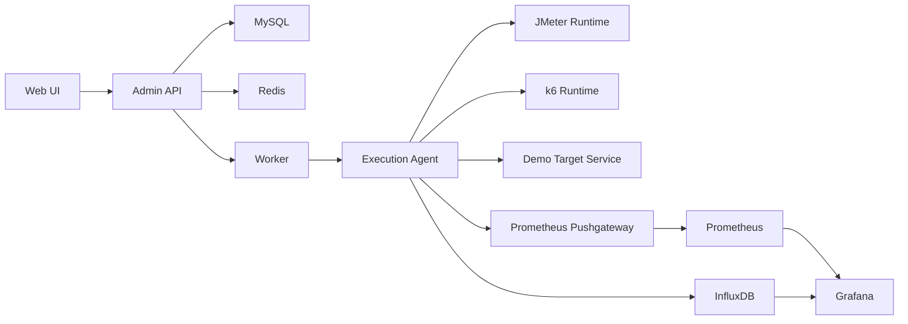

# OpenLoadHub Architecture

The platform is split into a control plane, an execution agent, and observability services.

## Components

| Component | Responsibility |
| --- | --- |
| Web UI | Task, script, run, report, and dashboard workflows |
| Admin API | Control-plane API, persistence, auth, and orchestration |
| Worker | Background scheduling and execution dispatch |
| Agent | Local JMeter / k6 execution and artifact collection |
| Demo Target Service | Local HTTP and gRPC endpoints used by seeded demo tasks |
| MySQL | Control-plane state |
| Redis | Queue and result backend. This is platform infrastructure, not a Redis-protocol test target. |
| InfluxDB | JMeter time-series data |
| Prometheus | k6 and platform metrics |
| Grafana | Dashboards and visual inspection |

The Admin API can derive non-blocking quality helpers:

- ScenarioQualityLint-lite for task and plan configuration warnings
- Advanced analysis and report-review summaries for later public releases

In the first public alpha, only lightweight scenario configuration hints are intended to be visible by default. Advanced analysis and report-review panels stay hidden from the default public UI.

These are rule-based summaries over existing platform data. They are not AI analysis, root-cause analysis, or production acceptance gates.

## Runtime Dependency Modes

| Component | Local demo | Shared / cloud deployment |
| --- | --- | --- |
| MySQL | Local compose service | Managed MySQL or HA MySQL |
| Redis | Local compose service | Managed Redis or HA Redis |
| Scripts and task assets | Docker volumes | S3-compatible object storage, MinIO, or equivalent shared storage |
| Agent dispatch | Static `AGENT_HOSTS=ptp-agent:9096,ptp-agent-2:9096,ptp-agent-3:9096,ptp-agent-4:9096` | Static `AGENT_HOSTS=agent-a:9096,agent-b:9096` |
| Nacos | Not required | Optional dynamic discovery or Nacos-specific demos |
| Kafka | Not required | Optional test target or extension demo |
| SkyWalking | Not required | Optional APM integration |
| Alertmanager | Not required | Optional alerting integration |

## Public Alpha Boundaries

The public alpha should keep the runtime small and understandable:

- one admin API
- one worker
- four fixed execution agents
- one local HTTP + gRPC demo target service
- local MySQL and Redis
- local InfluxDB, Prometheus, and Grafana

The local demo intentionally does not include Nacos, Kafka, SkyWalking, Alertmanager, MinIO, or dynamic agent discovery. For larger shared and traditional cloud deployments, see [Deployment Guide](deployment.md).
